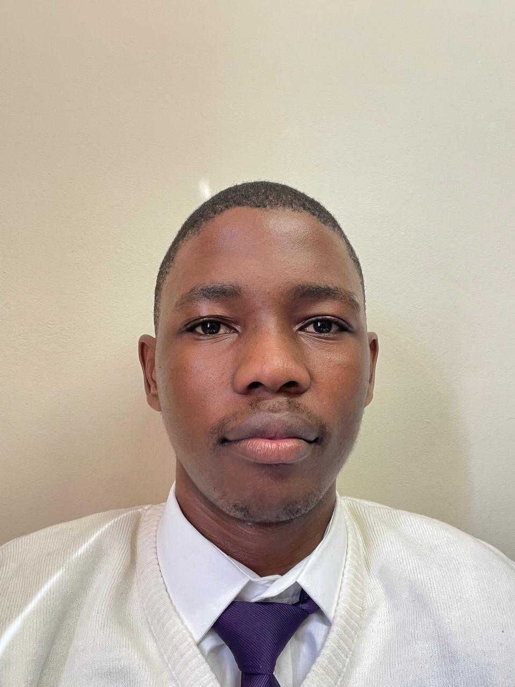

<html lang="en">
<head>
  <meta charset="UTF-8" />
  <meta name="viewport" content="width=device-width, initial-scale=1.0"/>
  <title>Lesedi Mileng - CV</title>
  <link href="https://fonts.googleapis.com/css2?family=Roboto:wght@300;500;700&display=swap" rel="stylesheet">
  
</head>
<body>
  

    <!-- Header -->
    

      
      

        <h1>Lesedi Mileng</h1>
        

          📧 <a href="mailto:leslymileng@gmail.com">leslymileng@gmail.com</a> 
          📞 076 557 0593 
          📍 Potchefstroom, North West, South Africa 
        

        <a href="Lesedi CV.pdf" class="btn" target="_blank">📄 Download CV PDF</a>
      

    

    <!-- Summary -->
    

      <h2 class="section-title">Summary</h2>
      

       Driven and intellectually curious final-year BSc Information Technology student, majoring in Computer Science and Information Systems, with a solid foundation in backend development. Proficient in Java, Python, C#, and C++, with firsthand experience through academic projects that have honed both technical and teamwork skills. Enthusiastic about leveraging technology to solve real-world problems and create meaningful impact. Eager to launch a career in software development or programming, with a long-term goal of contributing to innovative, scalable solutions that drive technological progress and improve lives.

      

    

    <!-- Education -->
    

      <h2 class="section-title">Education</h2>
      
<strong>BSc in Information Technology</strong> (2023–2025) North-West University

      
<strong>High School</strong> (2018–2022) Curro Academy Mahikeng

    

    <!-- Experience -->
    

      <h2 class="section-title">Experience</h2>
      
<strong>JB Marks Municipal Management System</strong> – Team Project 
      Built a desktop application to manage municipal operations, including clients, officers, services, and service requests. Features included request approval and assignment, service tracking, and reporting of top services rendered. Focused on maintaining entity relationships and efficient data handling.
      

      
<strong>RCL Committee (High School)</strong> 
        Served as a student representative (2021–2022), contributing to leadership initiatives and peer collaboration.

    

    <!-- Technical Skills -->
    

      <h2 class="section-title">Technical Skills</h2>
      <ul>
        <li><strong>Languages:</strong> Java, Python, C#, C++</li>
        <li><strong>Tools:</strong> Visual Studio, Code::Blocks, Git, Packet Tracer</li>
        <li><strong>Databases:</strong> SQL Server, Oracle</li>
        <li><strong>Frameworks:</strong> ASP.NET, Windows Forms</li>
        <li><strong>Concepts:</strong> OOP, Agile Development</li>
      </ul>
    

    <!-- Certifications -->
    

      <h2 class="section-title">Certifications</h2>
      <ul>
        <li><a href="https://assets.visualcv.com/assets/3739227/Microsoft AI.pdf" target="_blank">Microsoft AI Fluency Course</a></li>
      </ul>
    

    <!-- Achievements -->
    

      <h2 class="section-title">Achievements</h2>
      <ul>
        <li>Ratu Lebone Men's Recidence FNAS Top Achiever – 3rd Place (2023)</li>
        <li>NWU Faculty 3v3 Basketball - 3rd Place (2023)</li>
        <li>NWU Soccer Residence League Champion – 2023, 2024</li>
        <li>CAT Olympiad – Bronze (2022)</li>
        <li>District U/17 Long Jump Runner-up (2021)</li>
      </ul>
    

    <!-- Hobbies -->
    

      <h2 class="section-title">Hobbies</h2>
      
Basketball, soccer, gaming, working out, reading books

    

  

</body>
</html>
